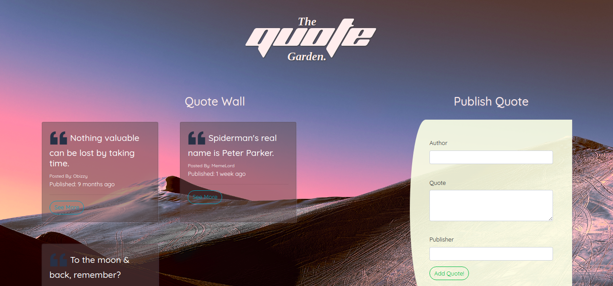

# Quotes

### Author
 **[Isaac Gichuru.](https://github.com/Isaacg94)**

## Description

A website that allows a posting of quotes by users as well as interacting with the posted quotes.

**[Live-Link to site.](https://isaacg94.github.io/quote-website/)**
## Features

* Interactive cards that show the posted quotes.
* A drop down on the cards to reveal details.
* A like and dislike button to upvote and downvote a qote.
* A delete button to delete a quote.
* A form to add a new quote.

## Behaviour Driven Development (BDD)
|Behaviour 	           |    Input 	                 |       Output          |
|----------------------------------------------|:-----------------------------------:|-----------------------------:|       
|Page loads, reveals interactive cards that contain the quotes posted and a form to add their own.                        |   User fills the Author, Quote and Publisher sections of the form.                  |A new interactive card containing the new quote appears.     |                       |

## Setup/Installation Requirements
Here is a run through of how to set up the application:
* Step 1 : Clone this repository using the git clone link:
  * **`git clone https://github.com/Isaacg94/quote-website.git`**
* Step 2 : Navigate to the directory:
  * **`cd Quotes`**
* Step 3 : Open the directory created with your favorite IDE. If Atom type **`atom .`** if VSCode type **`code .`** . This will lauch the editor with the project setup,
* Now feel free to hack around the project.

## Known Bugs

- The form displays the validation alerts when subitted. 

## Technologies Used

- Angular CLI version  8.3.4
- HTML
- CSS
- Javascript
- Bootstrap 4.3.1

## Support and contact details

Primary E-mail Address: 7248zack@gmail.com

### License
*MIT License* 

Copyright (c) 2019 **Isaac Gichuru**

